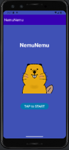
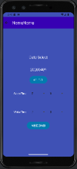
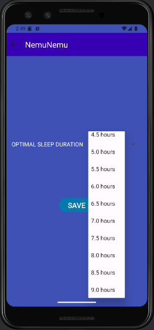
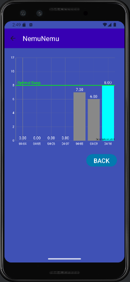
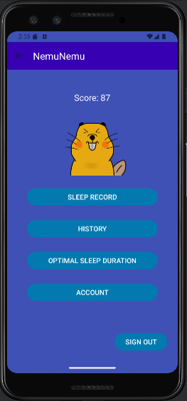

# NemuNemu

NemuNemu is an Android sleep-tracking application developed with Java. It helps users record their sleep, compare actual sleep duration with their personal optimal sleep duration, and review sleep history through a visual chart.

The application was developed as a project to practice Android application development, SQLite database management, REST API integration, JSON processing, and asynchronous network communication.

## Features

* User registration and sign-in
* Account management and account deletion
* Sleep record creation

  * Sleep time
  * Wake-up time
  * Sleep duration calculation
* Personalized optimal sleep duration
* Sleep score calculation based on actual vs. optimal sleep duration
* Sleep history tracking
* Sleep history visualization with a chart
* Full moon information retrieved from an external API
* Full moon bonus applied to the sleep score
* Character progression based on sleep score
* Local data storage using SQLite
* Persistent user/session settings using SharedPreferences

## How It Works

1. Users create an account and sign in.
2. Users set their optimal sleep duration.
3. Users record their sleep and wake-up times.
4. NemuNemu calculates the actual sleep duration.
5. The application calculates a sleep score by comparing actual sleep duration with the user's optimal duration.
6. Full moon information is retrieved from an external REST API and incorporated into the score calculation.
7. Users can review their previous sleep records and scores in the history screen.

## Technologies

### Mobile Development

* Java
* Android SDK
* AndroidX
* Material Components
* ConstraintLayout

### Data & Storage

* SQLite
* SharedPreferences
* Gson for JSON processing

### Networking

* OkHttp
* REST API
* JSON

### Data Visualization

* MPAndroidChart

### Development Tools

* Android Studio
* Gradle
* Git
* GitHub

## Screenshots

### Home


### Sleep Record


### Optimal Sleep Duration


### History


### Account


## Project Structure

```text
NemuNemu/
├── app/
│   └── src/
│       ├── androidTest/
│       ├── main/
│       │   ├── java/
│       │   │   └── com/example/nemunemu/
│       │   └── res/
│       └── test/
├── gradle/
├── build.gradle.kts
├── gradle.properties
├── gradlew
├── gradlew.bat
└── settings.gradle.kts
```

## Key Implementation Areas

### SQLite Database

The application uses SQLite for local data management, including user accounts and sleep records.

### REST API Integration

NemuNemu uses OkHttp to communicate with an external REST API and Gson to process JSON responses.

### Sleep Score

The application compares the user's actual sleep duration with their configured optimal sleep duration to calculate a sleep score.

The score is then used to provide feedback through the application's character progression system.

### Sleep History

Sleep records are stored locally and displayed through a history screen with a chart to help users review their sleep patterns over time.

## What I Practiced

Through this project, I practiced:

* Android application development with Java
* Activity-based UI navigation
* SQLite database operations
* CRUD operations
* REST API integration
* JSON parsing
* Asynchronous network requests
* SharedPreferences
* Data visualization
* Gradle dependency management
* Git and GitHub version control

## Project Status

This project was developed as an Android application project and is maintained as a portfolio project.

## Author

Yoshiki Do
